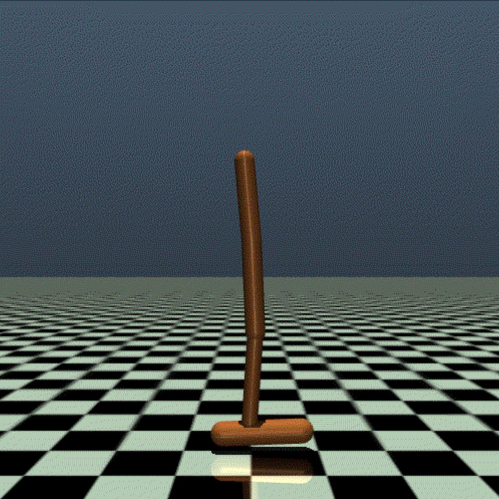
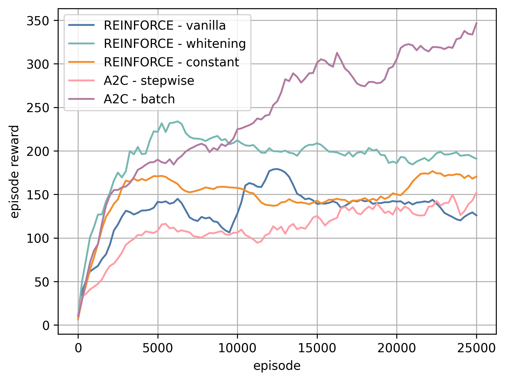
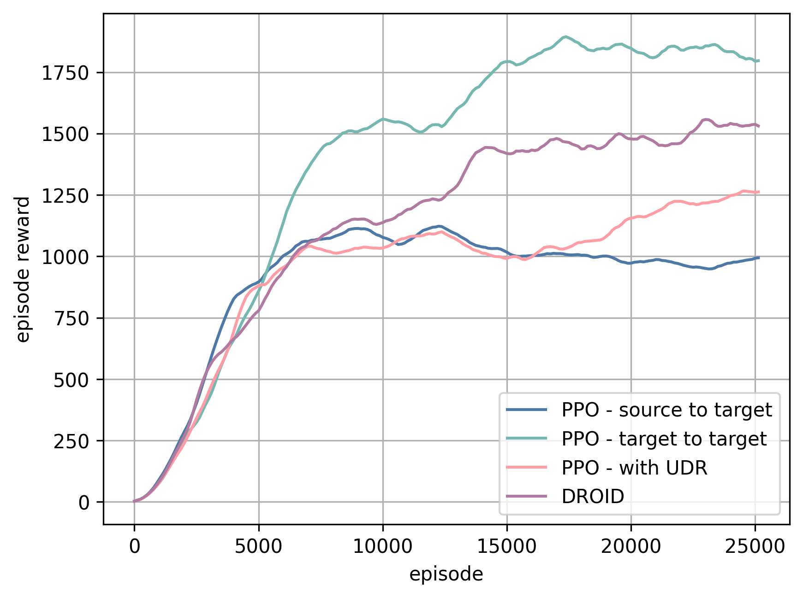

# Domain Randomization in Robotic Control

##### by Yasaman Golshan, Sara Asadi, Francesco Giuseppe Gillio.

## Table of Contents

- [Report Abstract](#report-abstract)
- [Environment](#environment)
- [Requirements](#requirements)
- [Algorithms](#algorithms)
  - [REINFORCE](#reinforce)
  - [A2C](#a2c)
  - [PPO](#ppo)
  - [Hyperparameters Tuning](#hyperparameters-tuning)
- [Uniform Domain Randomization](#uniform-domain-randomization)
- [Domain Randomization Optimization IDentification](#domain-randomization-optimization-identification)
- [Example of Training](#example-of-training)

## Report Abstract

This project aims to enhance reinforcement learning (RL) agents within the Gym Hopper environment by utilizing the MuJoCo physics engine for accurate modeling. The Hopper, a one-legged robot, must learn and master jumping and maintaining balance while optimizing horizontal speed. Our approach includes implementing and comparing several RL algorithms: REINFORCE (Vanilla Policy Gradient), Advantage-Actor-Critic (A2C), and Proximal Policy Optimization (PPO). Currently, applying Reinforcement Learning effectively to robotics poses a significant challenge, mainly due to the complexities of learning in real-world environments and accurately simulating physics. This project explores various algorithms and delves into Domain Randomization Optimization IDentification, an advanced technique for Domain Randomization.

Preliminary results indicate that combining domain randomization techniques with advanced RL algorithms significantly improves the Hopper’s stability and speed across diverse scenarios. This study demonstrates the effectiveness of domain randomization in developing resilient robotic control strategies, contributing to the advancement of RL applications in uncertain and dynamic environments. Our findings hold the potential to inform future research and applications in robotic control and autonomous systems. 

## Environment



The [Hopper](https://www.gymlibrary.ml/environments/mujoco/hopper/) of MuJoCo, a two-dimensional figure with one leg, comprises four primary body parts: a top `torso`, a middle `thigh`, a bottom `leg`, and a single `foot` supporting the entire body. The objective involves generating forward (rightward) movement through torque application at the three hinges connecting these body segments.
In this study, we implemented two customized versions of the Gym Hopper environment: `CustomHopper-source-v0` and `CustomHopper-target-v0`. The main distinction between these environments concerns the mass of the Hopper's `torso`. Specifically, `CustomHopper-source-v0` sets the `torso` mass at `2.53429174` kg, while `CustomHopper-target-v0` raises it to `3.53429174` kg. 

The transition from the source to the target environment embodies the essence of sim-to-real transferability. This project aims to create algorithms capable of learning within simulation environments (`source`) and successfully applying acquired knowledge in real-world situations (`target`).

## Requirements

- [mujoco-py](https://github.com/openai/mujoco-py)
- [stable-baselines3](https://github.com/DLR-RM/stable-baselines3)

#### Setup for Google Colab

Clone the repository and install the Hopper environment system requirements packages by running the following commands:

```python
!git clone https://github.com/305909/gym-hopper.git
!bash gym-hopper/setups.sh
```

## Algorithms

The repository contains several implementations of RL algorithms, differing in control policies, learning strategies and domain randomization.

### REINFORCE

This project implements the REINFORCE (Monte-Carlo Policy Gradient) algorithm with three variations that differ for the usage of the baseline term:
1. without baseline
2. with constant baseline `baseline = 20`
3. whitening transformation baseline

For more details, check out our custom implementation of the REINFORCE (Monte-Carlo Policy Gradient) algorithm in the `mc.py` file inside the `agents` folder.

#### How to run the code on Google Colab

Train and test the REINFORCE (Monte-Carlo Policy Gradient) algorithm by running the following command:

```python
# run REINFORCE (Monte-Carlo Policy Gradient) algorithm
!python /content/gym-hopper/algorithms/MCP.py --train \
                                              --test
```

The `MCP.py` code offers the chance to set several execution parameters:

- `--train`: flag to start training the model
- `--test`: flag to start testing the model
- `--render`: flag to render the environment over training/testing
- `--device`: set the processing device ('cuda' for GPU, 'cpu' for CPU)
- `--train-env`: set the training environment
- `--test-env`: set the testing environment
- `--train-episodes`: set the number of training episodes
- `--test-episodes`: set the number of testing episodes
- `--eval-frequency`: set the evaluation frequency over training iterations
- `--input-model`: set the pre-trained input model (in .mdl format)
- `--directory`: set path to the output location for checkpoint storage (model and rendering)`  

For more details, check out the available execution parameters by passing the `--help` argument.

### A2C

This project implements the A2C (Advantage-Actor-Critic) algorithm with two variations that differ for the update method of the policy network:
1. `stepwise` fashion
2. `batch` fashion

For more details, check out our custom implementation of the Advantage-Actor-Critic algorithm in the `ac.py` file inside the `agents` folder.

#### How to run the code on Google Colab

Train and test the A2C algorithm by running the following command:

```python
# run A2C (Advantage-Actor-Critic) algorithm
!python /content/gym-hopper/algorithms/A2C.py --train \
                                              --test
```

The `A2C.py` code offers the chance to set several execution parameters as in the previous code. For more details, check out the available execution parameters by passing the `--help` argument.

### PPO

This project implements the PPO (Proximal Policy Optimization) algorithm using the open-source reinforcement learning library [stable-baselines3](https://github.com/DLR-RM/stable-baselines3).

#### How to run the code on Google Colab

Train and test the PPO algorithm by running the following command:

```python
# run PPO (Proximal-Policy-Optimization) algorithm
!python /content/gym-hopper/algorithms/PPO.py --train \
                                              --test
```

The `PPO.py` code offers the chance to set several execution parameters as in the previous codes. For more details, check out the available execution parameters by passing the `--help` argument.

### Hyperparameters Tuning

This project also implements parameter tuning for the algorithms under investigation. The `tunings` folder contains the tuning code for each algorithm:

- `MCPF.py`: code to tune the `REINFORCE` parameters;
- `A2C.py`: code to tune the `A2C` parameters;
- `PPO.py`: code to tune the `PPO` parameters;

#### How to run the code on Google Colab

Search for the optimal parameter configuration for each algorithm by running the following commands:

```python
# run gridsearch algorithm for the REINFORCE model
!python /content/gym-hopper/tunings/MCP.py
```
```python
# run gridsearch algorithm for the A2C model
!python /content/gym-hopper/tunings/A2C.py`
```
```python
# run gridsearch algorithm for the PPO model
!python /content/gym-hopper/tunings/PPO.py
```

## Uniform Domain Randomization

This project implements a `CustomHopper-source-UDR-v0` custom environment to introduce Uniform Domain Randomization (UDR). UDR involves varying the link masses of the Hopper robot during training, while maintaining the torso mass constant, to expose the agent to a range of dynamic conditions. For each link $i$, the environment instantiates the boundaries of the physical parameter distribution ($\mathcal{U_\phi}$) and randomly samples the $i$-th link mass at the beginning of each episode:

$$
\theta_i \sim \mathcal{U_\phi}((1 - \phi) \cdot \theta_{i}^{(0)}, (1 + \phi) \cdot \theta_{i}^{(0)})
$$

where:
- $\mathit{\theta_{i}^{(0)}} \rightarrow$ the original mass of the $i$-th link of the Hopper robot;
- $\mathit{\phi = 0.5} \rightarrow$ the variation factor;
- $\mathcal{U_\phi} \rightarrow$ continuous uniform distribution with variation factor $\phi$.
  
For more details, check out our custom implementation of the `CustomHopper-source-UDR-v0` environment in the `custom_hopper.py` file inside the `env` folder.

#### How to run the code on Google Colab

To enable Uniform Domain Randomization, set the custom environment `CustomHopper-source-UDR-v0` as testing environment, i.e. the execution parameter `test_env` to `'source-UDR'`. Train and test the PPO algorithm with UDR by running the following command:

```python
# run PPO (Proximal-Policy-Optimization) algorithm with UDR
!python /content/gym-hopper/algorithms/PPO.py --train \
                                              --test \
                                              --train-env 'source-UDR'
```

## Domain Randomization Optimization IDentification

This project explores Domain Randomization Optimization IDentification (DROID), an advanced approach in reinforcement learning aimed at refining simulation environments to enhance the robustness and transferability of learned policies. In contrast to traditional uniform domain randomization (UDR), which introduces broad stochastic variations to simulation parameters uniformly, DROID focuses on iteratively adjusting these parameters to closely approximate real-world dynamics.

### Problem Formulation

Initially, DROID sets $\theta$ to an initial set of physical parameters $\theta = \\{\theta_\text{torso}, \theta_\text{thigh}, \theta_\text{leg}, \theta_\text{foot}\\}$ that govern the simulation dynamics. This setup establishes an initial simulation data distribution $\mathcal{D}_{\text{sim}}(\theta^{(0)})$ from which iterative improvements begin. The algorithm proceeds through $M$ iterations, refining $\theta$ to progressively minimize the discrepancy.

- $\mathcal{D_{\text{real}}} = \\{(s_i, a_i)\\}_{i=1}^{N} \rightarrow$ real-world trajectory distribution;
- $\mathcal{D_{\text{sim}}}(\theta) = \\{(s_j', a_j')\\}_{j=1, \theta}^{N} \rightarrow$ simulation trajectory distribution parameterized by $\theta$;
- $\theta^{(0)} = \\{2.53, 3.93, 2.71, 5.09\\} \rightarrow$ initial parameters;
- $\mathcal{D_{\text{sim}}}(\theta^{(0)}) \rightarrow$ initial simulation data distribution;
- $\eta \rightarrow$ learning rate for parameter updates.

Here, $(s_i, a_i)$ and $(s_j', a_j')$ represent state-action pairs from the respective distributions.

### Algorithm Steps

   - $\theta = \theta^{(0)}$ (initialize parameters)
   - for $m = 1:M$ do:
     - $base = W(\mathcal{D_{\text{real}}}, \mathcal{D_{\text{sim}}}(\theta)) \rightarrow$ compute the initial Wasserstein distance
     - for each $\theta_i \in \theta$:
       - $\theta_i \leftarrow \theta_i + \eta \rightarrow$ perturb the parameter
       - $\mathcal{D_{\text{sim}}}(\theta_i) = \\{(s_j', a_j')\\}_{j=1, \theta_i}^{N} \rightarrow$ update simulation environment
       - $\mathcal{L_i} = W(\mathcal{D_{\text{real}}}, \mathcal{D_{\text{sim}}}(\theta_i)) \rightarrow$ compute loss via Wasserstein distance
       - $\nabla_i = \frac{\nabla_{\theta_i}\mathcal{L_i}}{\eta} \rightarrow$ compute gradient by finite difference approximation
       - $\theta_i \leftarrow clip(\theta_i, 0.01, 10.0) \rightarrow$ clip parameters to range within valid bounds
   - $\mathcal{D_{\text{sim}}}(\theta) \leftarrow \\{(s_j', a_j')\\}_{j=1, \theta}^{N}$


with:
- $W(\mathcal{D_{\text{real}}}, \mathcal{D_{\text{sim}}}(\theta)) = inf_{\gamma \in \Gamma(\mathcal{D_{\text{real}}}, \mathcal{D_{\text{sim}}}(\theta))} \mathit{E}_{(s,a) \sim \gamma} [c(s,a)] \]$

where:
- $\Gamma(\mathcal{D_{\text{real}}}, \mathcal{D_{\text{sim}}}(\theta))) \rightarrow$ the set joint distributions $\gamma(s,a,s',a')$ with marginals $\mathcal{D_{\text{real}}}$ and $\mathcal{D_{\text{sim}}}(\theta)$
- $c(s,a) \rightarrow$ the cost function

The Wasserstein distance minimizes the total cost of transforming the distribution $\mathit{D_{\text{real}}}$ into $\mathit{D_{\text{sim}}}(\theta)$, measuring the cost in terms of the distance between state-action pairs $(s_i, a_i)$ and $(s_j', a_j')$.

#### How to run the code on Google Colab

Train and test the DROID algorithm by running the following command:

```python
# run DROID (Domain Randomization Optimization IDentification) algorithm
!python /content/gym-hopper/algorithms/DROID.py --train \
                                                --test
```

The `DROID.py` code offers the chance to set several execution parameters as in the previous codes. For more details, check out the available execution parameters by passing the `--help` argument.

## Example of Training

Extract of monitoring during training for performance comparison of different algorithms.

<div style="display: flex; justify-content: space-between;">
    
    
</div>
